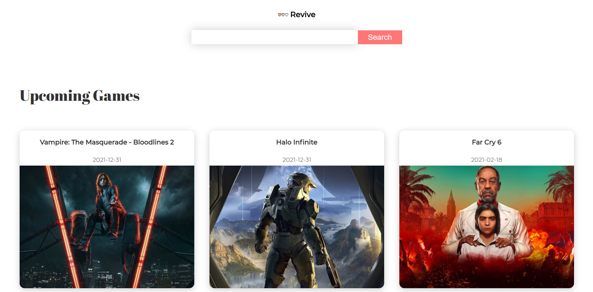
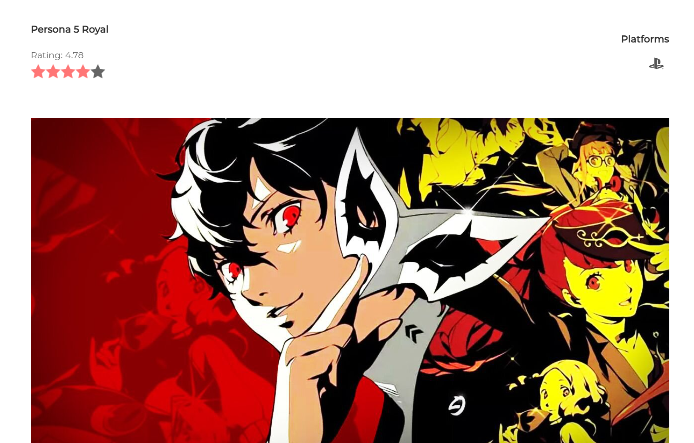

# Revive

<h1 id="intro">Introduction</h1>
Revive utilizes the rawg.io API to display all the latest and hottest video games.  Users can see new, popular, and upcoming video games that are regularly updated.  Users can also look up detailed information about each video game with smooth animations and visuals.

<!-- <h1 id="user_guide">User Guide</h1>
Go to <a href="https://geschur.herokuapp.com/">geschur.herokuapp.com</a> to see Geschur in action! -->

## To start the app:

### Run

### `yarn start`

Open localhost:3000 to open the app in the browser.
<h1 id="tech_stack">Tech Stack</h1>
Revive was made using React, Redux, and Framer Motion.